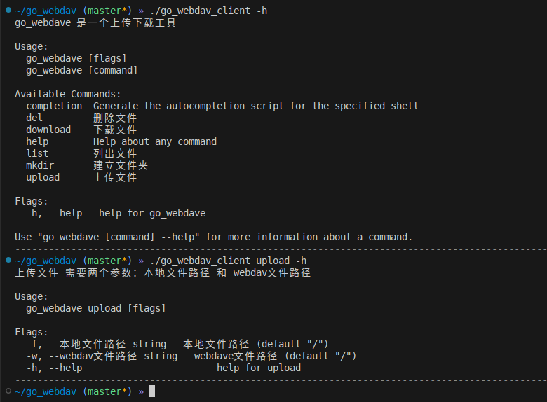

[中文](./Readme_zh.md)

## WebDAV Client 

### Compiled Binary

[release](https://github.com/xtccc/go_webdav_client/releases)

### Tool Usage Screenshot



```
./go_webdav_client init -u https://192.168.31.175

./go_webdav_client list -w /
```

## License and Agreement

The `go_webdav_client` project is open-sourced under the GPL-3.0 license. Copyright for the project is held by its founder and developer, xtccc.