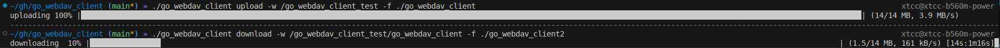
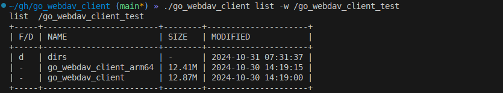

# WebDAV Client


[中文](./Readme_zh.md)

## support file upload and download 



```txt
./go_webdav_client upload -h
Uploading files requires two parameters: local file path and webdav file path

Usage:
  go_webdav_client upload [flags]

Flags:
  -f, --本地文件路径 string   local file path (default "/")
  -w, --webdav文件路径 string   webdav file path (default "/")
  -h, --help                        help for upload

./go_webdav_client download -h
Downloading a file requires two parameters: local file path and webdav file path

Usage:
  go_webdav_client download [flags]

Flags:
  -w, --webdav文件路径 string   webdav file path (default "/")
  -f, --本地文件路径 string   local file path (default "/")
  -h, --help                        help for download
```

## show files in dir




## Support folder creation

```txt
./go_webdav_client mkdir -h
Create folders to support multi-layer creation

Usage:
  go_webdav_client mkdir [flags]

Flags:
  -w, --webdav文件路径 string   webdav file path
  -h, --help                        help for mkdir
```

## Supports file deletion and folder deletion

```txt
./go_webdav_client del -h
Delete files/delete folders support recursion

Usage:
  go_webdav_client del [flags]

Flags:
  -w, --webdav文件路径 string   webdav file path
  -h, --help                        help for del
```

## Compiled Binary

[release](https://github.com/xtccc/go_webdav_client/releases)


## License and Agreement

The `go_webdav_client` project is open-sourced under the GPL-3.0 license. Copyright for the project is held by its founder and developer, xtccc.