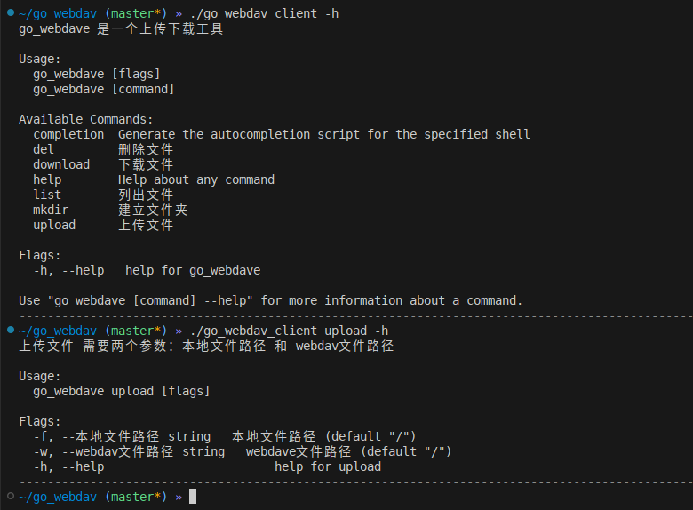

## webdav客户端工具


### 编译好的二进制

[release](https://github.com/xtccc/go_webdav_client/releases)

### 工具的使用截图



```

./go_webdav_client init -u https://192.168.31.175

./go_webdav_client list -w /

```

## 版权和协议

go_webdav_client 项目基于 GPL-3.0 开源协议开放项目源代码。本项目版权由项目发起人、开发者xtccc所有。