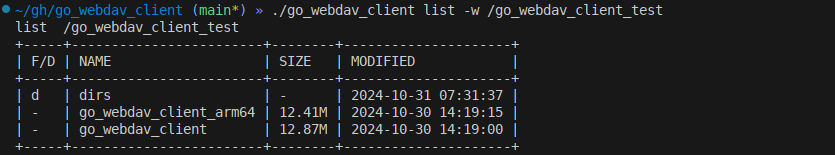

# webdav客户端工具

## 支持文件的上传下载 


```txt
./go_webdav_client upload -h
上传文件 需要两个参数：本地文件路径 和 webdav文件路径

Usage:
  go_webdav_client upload [flags]

Flags:
  -f, --本地文件路径 string   本地文件路径 (default "/")
  -w, --webdav文件路径 string   webdav文件路径 (default "/")
  -h, --help                        help for upload

./go_webdav_client download -h            
下载文件 需要两个参数：本地文件路径 和 webdav文件路径

Usage:
  go_webdav_client download [flags]

Flags:
  -w, --webdav文件路径 string   webdav文件路径 (default "/")
  -f, --本地文件路径 string   本地文件路径 (default "/")
  -h, --help                        help for download
  
```

## 支持文件的查看




## 支持文件夹的建立

```
./go_webdav_client mkdir -h
建立文件夹 支持多层建立

Usage:
  go_webdav_client mkdir [flags]

Flags:
  -w, --webdav文件路径 string   webdav文件路径
  -h, --help                        help for mkdir
```

## 支持文件的删除和文件夹的删除

```txt
./go_webdav_client del -h
删除文件/删除文件夹 支持递归

Usage:
  go_webdav_client del [flags]

Flags:
  -w, --webdav文件路径 string   webdav文件路径
  -h, --help                        help for del
```

## 编译好的二进制

[release](https://github.com/xtccc/go_webdav_client/releases)


## 版权和协议

go_webdav_client 项目基于 GPL-3.0 开源协议开放项目源代码。本项目版权由项目发起人、开发者xtccc所有。